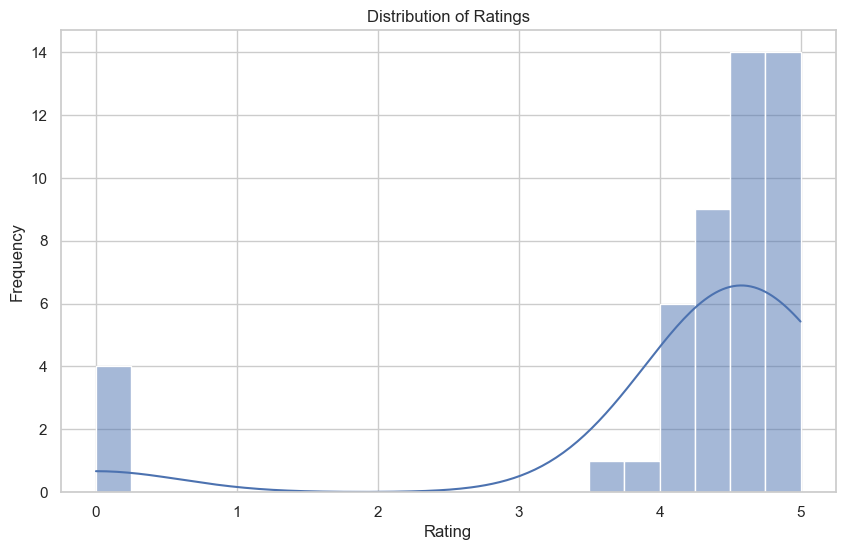

# Customer Segmentation Analysis for E-commerce Platform

## Project Overview

This project focuses on performing customer segmentation analysis for an e-commerce platform using data scraped from Amazon. The analysis aims to identify distinct customer groups based on their purchasing behavior, which can be utilized for targeted marketing strategies.

**_Disclaimer_**: _All datasets and reports do not represent any company, institution, or country but are based on simulated data to demonstrate analytical capabilities._

## Project Structure

The project consists of the following Jupyter Notebook files:

1. **webscrap.ipynb**: 
   - This notebook contains the code for web scraping data from Amazon, specifically targeting product reviews and ratings. The scraped data is saved in multiple CSV files for further processing.

2. **data_preprocessing.ipynb**:
   - In this notebook, the scraped data is preprocessed to clean and prepare it for analysis. Steps include:
     - Combining multiple CSV files into a single DataFrame
     - Handling missing values
     - Standardizing columns (e.g., price, ratings, reviews)
     - Removing outliers
     - Saving the cleaned data to a new CSV file.

3. **eda.ipynb**:
   - This notebook performs exploratory data analysis (EDA) on the cleaned dataset. Key activities include:
     - Analyzing distribution patterns of prices and ratings
     - Investigating average prices and ratings by brand
     - Visualizing relationships between ratings, reviews, and price
     - Building a predictive model to forecast product prices based on various features.

## Requirements

To run this project, you need to have the following packages installed:

- Python 3.x
- pandas
- numpy
- matplotlib
- seaborn
- scikit-learn
- BeautifulSoup (for web scraping)
- requests (for making HTTP requests)
  
## Data Sources
**Amazon Product Data**: The primary dataset used for this analysis is the "cleaned_amazon_data.csv" file, containing detailed information about products, including price, ratings, reviews, and brand.

## Tools
- **Python**: For data scraping, cleaning, and analysis
- **Visual Studio Code**: For exploratory data analysis and visualization
- **Libraries**:
  1.   pandas: For data manipulation and analysis.
  2.   numpy: For numerical operations and handling arrays.
  3.   matplotlib: For creating static, interactive, and animated visualizations.
  4.   seaborn: For enhanced statistical data visualization.
  5.   sklearn: For machine learning and predictive modeling.

## Data Cleaning/Processing
The dataset has been cleaned and is ready for analysis. Key preprocessing steps include:
- Merging multiple CSV files
- Handling missing values
- Standardizing columns (e.g., price, ratings, reviews)
- Removing outliers

## Problem Statement
1. What are the distribution patterns of prices and ratings across products?
2. How do average prices and ratings vary by brand?
3. What relationships exist between product ratings, reviews, and price?
4. How do sales ranks differ across brands?
5. Can we predict product prices based on ratings, reviews, and sales ranks?

## Exploratory Data Analysis
EDA involved exploring the cleaned dataset to answer key questions, such as trends in pricing, brand performance, and correlations between ratings and reviews.

## Skills/Concepts Demonstrated
### Python Features Utilized:
1. Data manipulation with Pandas
2. Data visualization with Matplotlib and Seaborn
3. Machine learning with Scikit-learn

### Data Analysis Tools/Techniques:
1. Descriptive statistics
2. Correlation analysis
3. Regression modeling
4. Data visualization techniques

## Analysis
### 1. Distribution Analysis


- The distribution of prices shows a right skew, with most products priced below $1,000.
- Ratings are generally high, with a concentration around 4.5.

### 2. Brand Analysis


- **Average Price**: The average price varies significantly by brand, with top brands commanding higher prices.
- **Average Rating**: High-rated brands typically have a larger volume of positive reviews.

### 3. Predictive Modeling
- A Random Forest Regressor was used to predict product prices based on ratings, reviews, and sales ranks.
- The Mean Squared Error of the model was approximately 256,930, indicating areas for improvement in predictive accuracy.

## Findings
1. **Price Distribution**: Most products are priced below $1,000, but a few premium products skew the average.
2. **High Ratings**: Products generally have high ratings, with a significant number of reviews correlating with ratings.
3. **Brand Performance**: Certain brands dominate in terms of both price and customer ratings.

## Recommendations
1. **Target High-Performing Brands**: Focus marketing efforts on brands that show high customer satisfaction and sales.
2. **Enhance Product Listings**: Improve visibility and information on lower-rated products to boost sales.
3. **Utilize Customer Feedback**: Leverage reviews to improve product features and address customer concerns.

## Limitations
The analysis is based on a limited dataset and may not fully capture all customer behaviors in the e-commerce landscape. The findings are for demonstration purposes.

## References
1. Data scraping techniques from BeautifulSoup documentation.
2. Pandas and Seaborn for data manipulation and visualization.

## You can install the required packages using pip:
```bash
pip install pandas numpy matplotlib seaborn scikit-learn beautifulsoup4 requests
